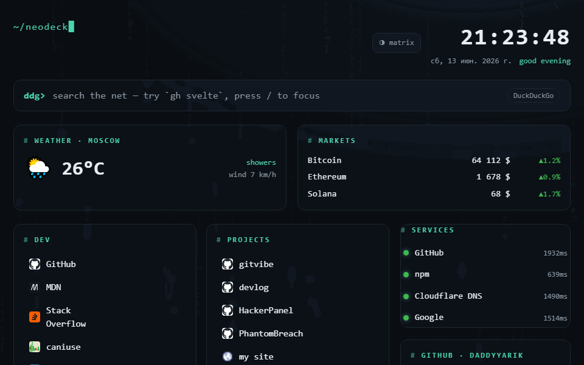

# NeoDeck

> A self-hostable, config-driven **cyberpunk-terminal dashboard** / browser start page.
> Set it as your new-tab page, point it at your homelab, make it yours — no build step required to customize.

**[🌐 Live demo →](https://daddyyarik.github.io/neodeck/)**



NeoDeck is a single static site: drop a `neodeck.config.json` next to it and the
whole dashboard reshapes itself — no rebuild, no backend. Built with Svelte +
Vite + TypeScript.

## Features

- ⌨️ **Smart search** with inline engine switching — type `gh svelte` to search GitHub, `npm vite`, `yt ...`. Press `/` anywhere to focus.
- 🔖 **Bookmarks** in groups, with auto-fetched favicons.
- 🟢 **Service status** — browser-side reachability checks for your services with latency.
- 🕓 **Clock** + time-aware greeting.
- 🎨 **4 themes** (matrix / amber / ice / magenta) + matrix-rain backdrop, toggle saved to `localStorage`.
- 🧩 **Config-driven** — everything lives in one JSON file. No coding to customize.
- ♿ Respects `prefers-reduced-motion`.

## Quick start

```bash
git clone https://github.com/DaddyYarik/neodeck
cd neodeck
npm install
npm run dev      # http://localhost:5173
```

Build the static site:

```bash
npm run build    # outputs to dist/
npm run preview  # serve the production build locally
```

## Configure

Copy the example and edit it — changes apply on reload, no rebuild needed:

```bash
cp public/neodeck.config.example.json public/neodeck.config.json
```

```jsonc
{
  "title": "NeoDeck",
  "theme": "matrix",          // matrix | amber | ice | magenta
  "matrixRain": true,
  "search": {
    "default": "ddg",
    "engines": [
      { "key": "gh", "name": "GitHub", "url": "https://github.com/search?q=%s" }
    ]
  },
  "bookmarks": [
    { "group": "dev", "links": [{ "label": "GitHub", "url": "https://github.com" }] }
  ],
  "services": [
    { "name": "My homelab", "url": "https://nas.local" }
  ]
}
```

`%s` in an engine URL is replaced by the (URL-encoded) query.

## Deploy

### GitHub Pages (automatic)

Push to `main` — the included workflow (`.github/workflows/deploy.yml`) builds
and publishes to Pages. Enable it under **Settings → Pages → Build and
deployment → GitHub Actions**.

### Docker (self-host)

```bash
docker compose up -d        # build + run, then open http://localhost:8080
```

Or without compose:

```bash
docker build -t neodeck .
docker run -d -p 8080:80 --name neodeck neodeck
```

To use your own config without rebuilding the image, mount it over the one in
the container:

```bash
docker run -d -p 8080:80 \
  -v "$(pwd)/neodeck.config.json:/usr/share/nginx/html/neodeck.config.json:ro" \
  neodeck
```

(or uncomment the `volumes:` block in `docker-compose.yml`). The image is a tiny
multi-stage build — Node compiles the site, nginx serves the static `dist/`.

### Anywhere static

`npm run build` produces a `dist/` folder of plain static files. Serve it with
Nginx, Caddy, Netlify, or any static host. Asset paths are relative, so it works
from a subfolder too.

## Roadmap

- [ ] Command palette (`Ctrl+K`)
- [ ] Drag-and-drop widget layout
- [ ] Optional tiny backend for system stats (CPU / RAM / disk) and CORS-free pings
- [x] More widgets: RSS, weather, crypto, GitHub activity, pomodoro, tasks, notes
- [x] Docker image + `docker-compose.yml`
- [ ] Theme editor

## License

MIT
